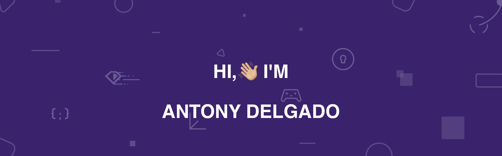

[]

### Hi there 👋

### I'm Antony, I'm a venezuelan living in Mexico! I'm a software developer where I participated in several web-oriented projects. I am currently a Solutions Center Manager, an area dedicated to addressing and identifying application incidents. In my free time I continue learning new trends in programming languages.

### I spent more than 9 years dedicated to software development with specialization in backend, I have been a technical leader in projects with multiple developers and I currently lead the technology incident area.

### 🌱 I’m currently learning Swift and Swift UI because I'm very interested in developing apps for iOS, I am also strengthening my knowledge in Python because I love the idea of ​​participating in projects oriented to Artificial Intelligence 🤖

<!--
**adelgadox/adelgadox** is a ✨ _special_ ✨ repository because its `README.md` (this file) appears on your GitHub profile.

Here are some ideas to get you started:

- 🔭 I’m currently working on ...
- 🌱 I’m currently learning ...
- 👯 I’m looking to collaborate on ...
- 🤔 I’m looking for help with ...
- 💬 Ask me about ...
- 📫 How to reach me: ...
- 😄 Pronouns: ...
- ⚡ Fun fact: ...
-->
